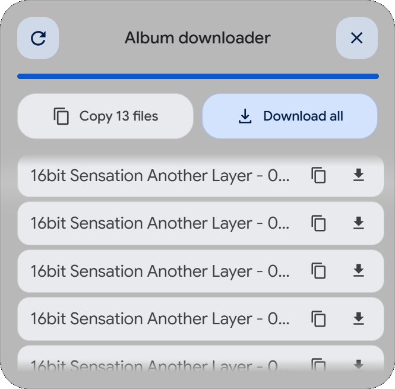
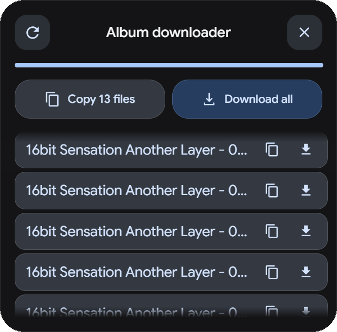

# Trình Tải Album Google Photos

Userscript Tampermonkey siêu nhẹ, mượt mà và bảo mật giúp lấy link tải trực tiếp chất lượng gốc của tất cả ảnh và video trong bất kỳ album chia sẻ hoặc album cá nhân nào trên Google Photos.

🌐 **[English (Tiếng Anh)](./README.md)**

  
  

---

## Các Tính Năng Nổi Bật

- **Tải Xuống Tất Cả (Download All)**: Tự động kích hoạt tải xuống hàng loạt, tuần tự (cách nhau 500ms) bằng iframe ẩn. Giúp tránh việc trình duyệt bị nghẽn hoặc chặn tải hàng loạt.
- **Sao Chép Toàn Bộ Link (Copy All Links)**: Sao chép toàn bộ đường dẫn tải trực tiếp vào clipboard chỉ với 1 cú click.
- **Danh Sách File Riêng Biệt**: Hiển thị danh sách cuộn mượt mà các tệp tin đã quét ngay trong bảng điều khiển. Cho phép sao chép link trực tiếp hoặc tải từng tệp riêng lẻ với các nút chức năng trực quan.
- **Ưu Tiên Chất Lượng Gốc**: Mặc định tải file ở chất lượng gốc (hoặc tự động chuyển sang chất lượng cao nhất khả dụng như video transcode).
- **Giao Diện Kính Mờ (Glassmorphic) Sáng/Tối**: Bảng điều khiển dạng kính mờ bán trong suốt kết hợp hiệu ứng blur sang trọng và màu nhấn xanh Google Photos Blue. Tự động nhận diện và chuyển đổi giao diện đồng bộ theo theme đang bật của Google Photos.
- **Bảo Mật An Toàn**: Hoàn toàn tuân thủ các quy tắc bảo mật CSP (Content Security Policy) và chính sách Trusted Types của Google Photos thông qua việc tạo các phần tử DOM bằng code thay vì dùng `innerHTML` không an toàn.
- **Chạy ở Cửa Sổ Chính**: Hoạt động an toàn dưới chỉ thị `@noframes` để đảm bảo chỉ kích hoạt một lần duy nhất tại cửa sổ chính.

---

## Hướng Dẫn Cài Đặt

### Cài Đặt Trực Tiếp (Nhanh Nhất)

1. Đảm bảo bạn đã cài đặt tiện ích quản lý Userscript (ví dụ: [Tampermonkey](https://www.tampermonkey.net/) hoặc [Violentmonkey](https://violentmonkey.github.io/)).
2. Nhấp vào nút dưới đây để cài đặt trực tiếp:

### Cài Đặt Thủ Công

1. Cài đặt tiện ích quản lý Userscript cho trình duyệt của bạn.
2. Sao chép toàn bộ mã nguồn của file [google_photos_album_downloader.user.js](./google_photos_album_downloader.user.js).
3. Mở Bảng điều khiển (Dashboard) của Tampermonkey/Violentmonkey, chọn tạo script mới.
4. Dán mã nguồn đã copy vào và nhấn **Lưu** (Ctrl + S).

---

## Cách Sử Dụng

1. Truy cập vào bất kỳ Album chia sẻ hoặc Album cá nhân nào trên Google Photos (`https://photos.google.com/share/...` hoặc `https://photos.google.com/album/...`).
2. Nhấn nút **Fetch Download Links** để bắt đầu quét các file trong album.
3. Sau khi quét xong:
   - Chọn **Copy All Links** để lưu toàn bộ link tải.
   - Chọn **Download All** để bắt đầu tự động tải toàn bộ ảnh/video về máy.
4. **Lưu ý trong lần tải đầu tiên**: Trình duyệt có thể hiển thị cảnh báo cho phép tải nhiều tệp. Bạn chọn **Allow (Cho phép)** để trình duyệt tự động tải xuống hàng loạt.

---

## Bản Quyền

Dự án này là mã nguồn mở và sử dụng hoàn toàn miễn phí. Bạn có thể sao chép, chỉnh sửa và chia sẻ tự do.
